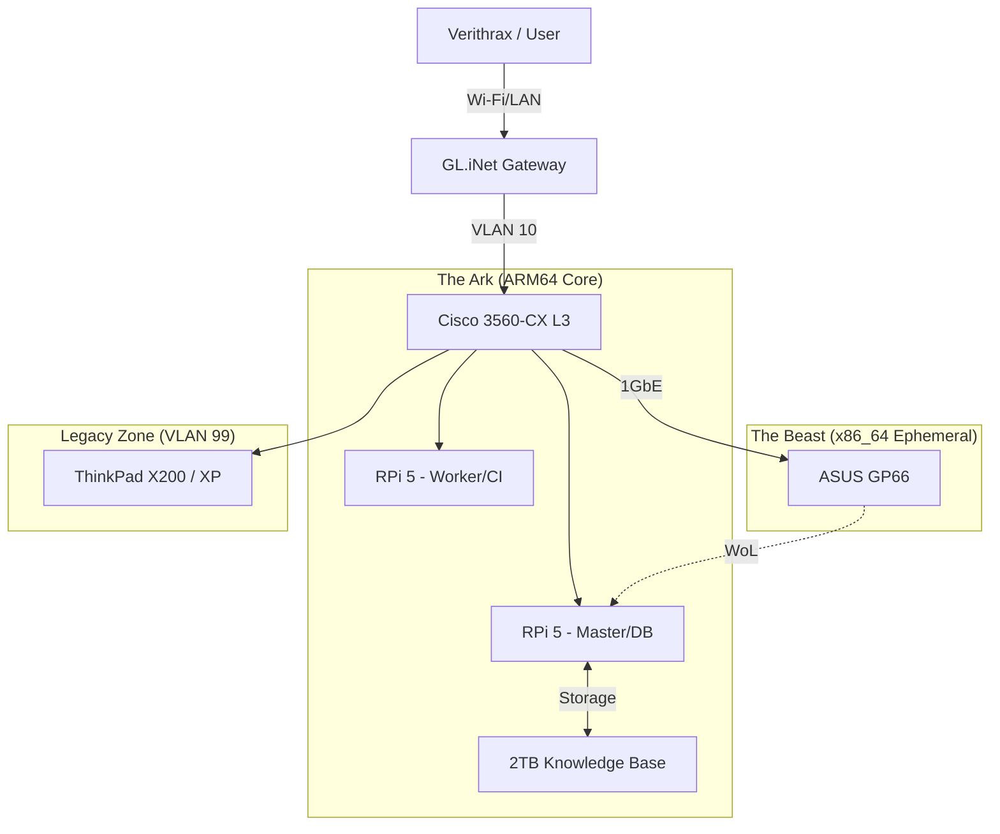

# RFC: Project Verithrax Ark - Portable Sovereign Infrastructure

| Metadata | Details |
| ---: | :--- |
| **Author** | Verithrax Xeon |
| **Status** | `Draft` / **`In Progress`** / `Implemented` |
| **Last Updated** | 2025-12-20 |
| **Target Platform** | Raspberry Pi 5 (ARM64) + x86_64 Hybrid Cluster |
| **Tags** | `Homelab`, `K3s`, `Offline-First`, `Edge-Computing`, `Legacy-Compat` |

---

## 1. Context & Objective (背景與目標)

### 1.1 Context
As a Field Engineer and Google Vendor transitioning to a new environment (relocation to Japan), there is a critical need for a portable, self-sufficient computing infrastructure. Reliance on public cloud services or uncertain local ISP connectivity poses risks to continuous skill development and legacy system maintenance.

### 1.2 Objective
To design and build **"Verithrax Ark"**, a portable, air-gapped capable data center contained within a carry-on compliant case (Pelican 1535 Air). This system must support:
* **Hybrid Compute:** Seamless orchestration between ARM (RPi) and x86 (Laptop) nodes.
* **Offline Intelligence:** A local LLM agent ("Gemini Jr.") capable of RAG (Retrieval-Augmented Generation) without internet access.
* **Legacy Compatibility:** Native support for managing legacy industrial systems (e.g., Windows XP, COBOL environments).
* **Network Sovereignty:** Enterprise-grade segmentation (VLANs) and secure remote access (Tunneling).

---

## 2. Problem Statement (問題陳述)

Current portable solutions (laptops only) lack the resilience and scalability required for simulating complex Data Center operations. Specifically:
1.  **Dependency on Connectivity:** Most dev environments break without high-speed internet (e.g., pip install, docker pull).
2.  **Architecture Silos:** Difficulty in testing cross-architecture (ARM vs x86) builds locally.
3.  **Security Risks:** Connecting legacy test environments (XP/Industrial IoT) directly to hotel/public Wi-Fi is insecure.

---

## 3. Non-Goals (非目標 - 釐清邊界)

* **High-Performance Gaming:** This cluster is for compute/compilation/simulation, not for rendering 3D graphics.
* **Public Production Hosting:** The system is designed for personal R&D and internal tooling, not for serving high-traffic public web applications.

---

## 4. System Architecture (系統架構)

### 4.1 High-Level Topology
The system follows a **Hub-and-Spoke** model where the RPi Cluster acts as the "Always-On Core" and the High-Performance Laptop acts as an "Ephemeral Worker."

### 4.2 Component Selection & Rationale (選型決策)
| Component | Selection | Rationale (Trade-off Analysis)
| ---: | :--- | :--- |
| Orchestrator | K3s | Lightweight, native support for multi-arch (ARM/x86) clusters, low memory footprint suitable for Edge. |
| AI Model | Gemma 3 (12B) | Selected over Llama 3 for better logic reasoning at smaller parameter size; optimized for RPi 5 16GB RAM. |
| Storage | NVMe (PCIe) | SD Cards are insufficient for Vector DB (RAG) IOPS. NVMe provides required throughput for index retrieval. |
| Networking | Cisco IOS™ | Chosen over Unifi/Mikrotik to replicate standard Enterprise Data Center environments and support legacy protocol testing. |

## 5. Detailed Design (詳細設計)
### 5.1 Hybrid Compute Strategy (The "Necromancer" Pattern)
To optimize power consumption vs. performance:

* **Default State:** RPi Cluster runs 24/7 (Control Plane + Light Workloads). Power draw < 20W.
* **Burst State:** For heavy compilation (Android ROMs) or batch vectorization, the RPi Master triggers a Wake-on-LAN (WoL) packet to the ASUS GP66.
* **Scheduler:** Kubernetes NodeAffinity rules ensure x86 workloads are automatically pending until the x86 node is Ready.

### 5.2 The "Offline Internet" (Data Strategy)
Implementing a Lambda Architecture for knowledge management:

* **Batch Layer:** Annual full dump of Wikipedia/IEEE/StackOverflow (processed on x86, stored on external SSD).
* **Speed Layer:** Daily incremental updates via RSS/APIs (processed on RPi).
* **Serving Layer:** Local LLM (Ollama) queries a unified Vector Database (ChromaDB/SQLite) to answer queries without WAN.

### 5.3 Legacy Containment
Legacy systems (e.g., Windows XP for COBOL debugging) are isolated in a strict VLAN (ID 99) with no WAN access. Traffic is allowed only to specific internal endpoints via Cisco ACLs, simulating a secure Industrial Control System (ICS) environment.

## 6. Security Considerations (資安考量)
* **Zero Trust:** All inter-service communication within K3s is mutual-TLS encrypted.
* **Physical Security:** The "Ark" (Pelican Case) storage is encrypted at rest (LUKS).
* **Air-Gap Protocol:** The system features a hardware "Kill Switch" (physically disconnecting the Uplink Router) while maintaining full internal functionality.

## 7. Cost & Bill of Materials (成本與物料)
See BOM.md for the detailed procurement list and FinOps breakdown. (Note: Prioritizing "Reuse" of existing laptop and "Incremental" purchase of RPi nodes to maintain cash flow during relocation.)

## 8. Future Work (未來展望)
* **Q2 2026:** Integration of SDR (Software Defined Radio) for RF spectrum analysis automation.
* **Q3 2026:** Migration of "Gemini Jr." to NPU-accelerated inference (Hailo/Coral) if supported.